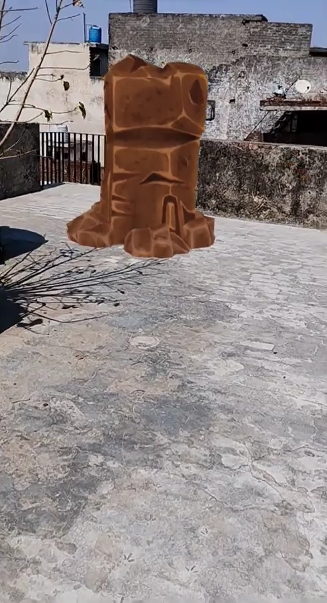

# AR Earth Bender 

## ⚒️ Development Tools
- Unity Engine 2021.3.15f1
- AR Foundation 4.2.7
- AR Core XR Plugin 4.2.7

## ⚒️ Running Locally
Make sure to use Unity 2020 or higher versions for this project to work properly.
* Download [Unity Hub](https://unity3d.com/get-unity/download "Unity Hub")
* Install Unity version 2020 or higher 
</img>
* Install Android Build Support, OpenJDK, Android SDK & NDK Tools
</img>
* Clone the repository `git clone https://github.com/Priyanshu-CODERX/ar-earth-bender-fx.git`
* Open the project with your Unity Engine
* Switch build platform to Android
* Go to project setting's and change the minimum api level to `Android 7.0 API Level 23`
* Build the apk

## 💡 Earth Bender Demo
